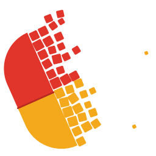

<!-- English version. Version française : README.md
     IMPORTANT: README.md (FR) and README.en.md (EN) must stay in sync.
     When you edit one, update the other accordingly. -->

# justelesRCP

### 🌐 Live site: **[justelesrcp.olicorne.org](https://justelesrcp.olicorne.org)**

*Lire ceci en [français](README.md).*

*Sister site: **[justelesrecospsy](https://justelesrecospsy.olicorne.org)**, the psychiatry practice guidelines, with the passage highlighted on the page of the official PDF.*

**Juste les RCP (=Only the SmPC) of every French and European medicine**. A fast,
ad-free, no-account static site giving access to the SmPC (Summaries of Product
characteristics, french: RCP stands for *résumés des caractéristiques du produit*)
published by the ANSM and by the EMA.
The goal: help clinicians and patients find reliable, official information faster,
without ads and without sacrificing their privacy. A lightweight alternative to
slow, for-profit medicine sites.

- Every page is a precomputed static file: no application server, no database,
  nothing to track on the visitor's side.
- Instant search over ~15,600 medicines, plus crawlable A-Z browse pages
  built for search engines (sitemap, canonical links, structured data and a
  breadcrumb on every page).
- Shareable results page: `justelesrcp.olicorne.org/?q=sertraline` lists every matching
  medicine (by brand name or active substance). It is also what you get by
  pressing Enter without picking a suggestion.
- Release notes: after the site is updated, a "Quoi de neuf ?" popup sums up in plain
  language what changed since your last visit (reachable any time from the About
  page).
- Built-in guided tour: on a first visit (or via the "Visite guidée" footer link,
  or the `?tour=1` URL), an interactive walkthrough introduces the search, then, on
  a concrete example, the update dates, the official source, the table of contents,
  the semantic search and the cross-drug links.
- **Natural-language search inside an RCP**: ask a question like "can I take it
  while pregnant?" and the page surfaces the passages that answer the *meaning*
  of your question, not just the exact words. Your question is analysed on our
  own server and immediately forgotten: never logged, never shared with a third
  party. The default model is
  [jinaai/jina-embeddings-v5-text-small](https://huggingface.co/jinaai/jina-embeddings-v5-text-small)
  (multilingual, run locally through ONNX, licensed CC BY-NC 4.0: this site is
  free and carries no advertising).
- Cross-drug backlinks: each page automatically links the drug and substance
  names it mentions to those drugs' own pages (never a dead link). These links
  are added by justelesRCP and are not part of the official text.
- Centrally-authorized medicines (whose RCP is published by the EMA, not the
  ANSM, e.g. Abilify): their official RCP is fetched, converted and shown here,
  with a link to the source document on the EMA.
- Privacy-respecting analytics (umami: no cookies, no ad tracking). Hosted in
  France.

> [!CAUTION]
> **In-development prototype.** Some features are missing and bugs are likely.

## How it works

The starting point is the
[latest bulk export of ANSM RCPs](https://www.data.gouv.fr/datasets/base-de-donnees-publique-des-medicaments-defi-idoc-sante),
**frozen at 2 May 2022**: it is the only complete HTML export that exists (the daily official BDPM
download ships metadata only, not the RCP text). That baseline covers only the
ANSM, not centrally-authorized (EMA) medicines.

From there the content is refreshed **progressively**: a background service
fetches the official pages a few at a time, every few minutes, starting with the
most-read medicines, and any reader can request an immediate refresh of a page
with a button. Over time this builds a **local, up-to-date copy** of the data,
without ever hammering the source sites: infrequent, rate-limited requests, and a
single request even when many readers view the same page.

For centrally-authorized medicines, the RCP is published by the EMA as a PDF. I
asked the EMA about it, and they confirmed we had to fetch it ourselves this way,
as there is no planned access to the RCPs. So justelesRCP downloads that official
PDF, converts it into a readable page and always links back to the source
document.

All rendering is precomputed: nothing dynamic runs when serving the pages.
Natural-language search and on-demand refresh are two optional, hardened
companion services kept separate from the web server.

To run it yourself or for the detailed architecture, see [CLAUDE.md](CLAUDE.md).

## Data source and licence

The data comes from the
[Base de données publique des médicaments (BDPM)](https://base-donnees-publique.medicaments.gouv.fr/telechargement),
published by the ANSM, and is reused under the
[Licence Ouverte / Etalab 2.0](https://www.etalab.gouv.fr/licence-ouverte-open-licence/)
in compliance with that licence: it cites the source and its date, does not
distort the data, and does not imply any official status. The RCP baseline dates
from 2 May 2022, so the content can be old even though pages are progressively
refreshed. justelesRCP is not affiliated with any authority (ANSM, HAS, EMA…) and
does not replace professional medical advice.

## Questions?

The simplest is to read the code, open an *issue*, or contact me via
[olicorne.org/en/contact](https://olicorne.org/en/contact).

## Credits

Built with the help of [Claude Code](https://claude.com/claude-code).
